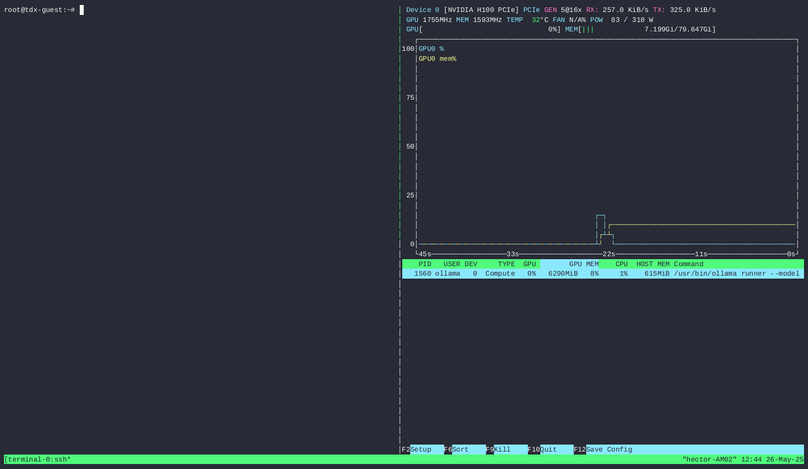

# Intel® Trust Domain Extensions (TDX) on Ubuntu

### Table of Contents:
* [1. Introduction](#introduction)
* [2. Report an Issue](#report-an-issue)
* [3. Supported Hardware](#supported-hardware)
* [4. Setup Host OS](#setup-host-os)
* [5. Create TD Image](#create-td-image)
* [6. Boot TD](#boot-td)
* [7. Verify TD](#verify-td)
* [8. Boot TD with NVIDIA H100 GPU](#boot-td-gpu)
* [9. Setup Remote Attestation on Host OS and Inside TD](#setup-remote-attestation)
* [10. Perform Remote Attestation Using Intel Tiber Trust Services CLI](#perform-remote-attestation)
* [11. Inspect Event Log and Measurements](#inspect-event-log-and-measurements)
* [12. Build Packages From Source](#build-packages-from-source)
* [13. Build Kernel From Source](#build-kernel-from-source)
* [14. Run Tests](#sanity-functional-tests)
* [15. Troubleshooting Tips](#troubleshooting-tips)

<!-- headings -->
<a id="introduction"></a>
## 1. Introduction
Intel® TDX is a Confidential Computing technology which deploys hardware-isolated,
Virtual Machines (VMs) called Trust Domains (TDs). It protects TDs from a broad range of software attacks by
isolating them from the Virtual-Machine Manager (VMM), hypervisor, and other non-TD software on the host platform.
As a result, Intel TDX enhances a platform user’s control of data security and IP protection. Also, it enhances the
Cloud Service Providers’ (CSP) ability to provide managed cloud services without exposing tenant data to adversaries.
For more information, see the [Intel TDX overview](https://www.intel.com/content/www/us/en/developer/tools/trust-domain-extensions/overview.html).

This tech preview of Intel TDX on Ubuntu provides base host OS, guest OS, and remote attestation functionalities.
Two Ubuntu releases are currently supported for base host OS and guest OS:
* Ubuntu Plucky 25.04 with device pass-through support for NVIDIA H100 Tensor Core GPU 
* Ubuntu Noble 24.04 LTS

Follow these instructions to set up the Intel TDX host, create a TD, boot the TD, and attest the integrity of the TD's execution environment.

The host OS and TD setup can be customized by editing the global configuration file: `setup-tdx-config`.

<a id="report-an-issue"></a>
## 2. Report an Issue
First, check the [Troubleshooting Tips](#troubleshooting-tips) section. 

If your issue can't be resolved, then submit an issue [here](https://github.com/canonical/tdx/issues) and we'll get back to you ASAP.

To help us with the debugging process, run the `system-report.sh`
tool and attach the report.  

<a id="supported-hardware"></a>
## 3. Supported Hardware
This table lists the Host OS Ubuntu versions and the hardware\* they support:

| Ubuntu Version | Processor | Code Name | TDX Module Version |
| - | - | - | - |
| 24.04, 25.04\* | 4th Gen Intel® Xeon® Scalable Processors (select SKUs with Intel® TDX) | Sapphire Rapids | 1.5.x |
| 24.04, 25.04\* | 5th Gen Intel® Xeon® Scalable Processors | Emerald Rapids | 1.5.x |
| 24.04, 25.04\* | Intel® Xeon® 6 Processors with E-Cores | Sierra Forest | 1.5.x |
| 24.04, 25.04\* | Intel® Xeon® 6 Processors with P-Cores | Granite Rapids | 2.0.x |

\* Ubuntu Plucky 25.04 host + Ubuntu Noble 24.04 guest are needed to enable device pass-through support for NVIDIA H100 Tensor Core GPU

To help identify which processor you have, please visit [ark.intel.com](https://www.intel.com/content/www/us/en/ark.html) and search for the part number. 
Then, look for "Code Name" and "Intel® Trust Domain Extensions (Intel® TDX)".

<a id="setup-host-os"></a>
## 4. Setup Host OS
In this section, you will install a generic Ubuntu server image, install necessary packages to turn
the host OS into an Intel TDX-enabled host OS, optionally install remote attestation components, and enable Intel TDX settings in the BIOS.

### 4.1 Install Ubuntu Server Image

Download and install appropriate Ubuntu Server on the host machine:
* [Ubuntu Plucky 25.04 server](https://releases.ubuntu.com/25.04/)
* [Ubuntu Noble 24.04 server](https://releases.ubuntu.com/24.04/)

### 4.2 Enable Intel TDX in Host OS

1. Download this repository by downloading an asset file from the [releases page on GitHub](https://github.com/canonical/tdx/releases) or by cloning the repository (at the appropriate tag/branch).
   
   For example, to clone the development branch (replace `main` by a release tag if you want a specific release): 

   ```bash
   git clone -b main https://github.com/canonical/tdx.git
   ```

2. Customize the setup of the host and TD by editing the configuration file `setup-tdx-config`.  
    By default, remote attestation components are not installed on the host and inside the TD.  
    You can choose to automatically install remote attestation packages provided by Canonical by setting `TDX_SETUP_ATTESTATION=1`.  
   In this case, you can skip [step 9.2.1](#step-9-2-1) and [step 9.3.3](#step-9-3-3).  

3. Run the `setup-tdx-host.sh` script.<a id="step-4-2-3"></a>

    NOTE: If you're behind a proxy, use `sudo -E` to preserve user environment.

   ```bash
   cd tdx
   sudo ./setup-tdx-host.sh
   ```

4. Reboot.

### 4.3 Enable Intel TDX in the Host's BIOS<a id="step-4-3"></a>

1. Go into the host's BIOS.

    NOTE: The following is a sample BIOS configuration.
    The necessary BIOS settings or the menus might differ based on the platform that is used.
    Please reach out to your OEM/ODM or independent BIOS vendor for instructions dedicated for your BIOS.

2. Go to `Socket Configuration > Processor Configuration > TME, TME-MT, TDX`.

	* Set `Memory Encryption (TME)` to `Enable`
	* Set `Total Memory Encryption Bypass` to `Enable` (Optional setting for best host OS and regular VM performance.)
	* Set `Total Memory Encryption Multi-Tenant (TME-MT)` to `Enable`
	* Set `TME-MT memory integrity` to `Disable`
	* Set `Trust Domain Extension (TDX)` to `Enable`
	* Set `TDX Secure Arbitration Mode Loader (SEAM Loader)` to `Enable`. (NOTE: This allows loading Intel TDX Loader and Intel TDX Module from the ESP or BIOS.)
	* Set `TME-MT/TDX key split` to a non-zero value

3. Go to `Socket Configuration > Processor Configuration > Software Guard Extension (SGX)`.

	* Set `SW Guard Extensions (SGX)` to `Enable`

4. Save the BIOS settings and boot up.

### 4.4 Verify Intel TDX is Enabled on Host OS

Verify that Intel TDX is enabled using the `dmesg` command:

```bash
sudo dmesg | grep -i tdx
```

The message `virt/tdx: module initialized` proves that Intel TDX has initialized properly. Here is an example output:

```console
...
[    5.205693] virt/tdx: BIOS enabled: private KeyID range [64, 128)
[   29.884504] virt/tdx: 1050644 KB allocated for PAMT
[   29.884513] virt/tdx: module initialized
...
```

<a id="create-td-image"></a>
## 5. Create TD Image

In this section, you will create an Ubuntu-based TD (aka guest) image from scratch or convert an existing VM image into a TD image. 
This can be performed on any Ubuntu 22.04 or newer system - an Intel TDX-specific environment is not required.

* The base image is an Ubuntu cloud image.
* By default, the Ubuntu generic kernel is used for the TD image. The `-intel` kernel, which may have non-upstreamed and/or under-development features,
  can be selected by setting the variable `TDX_SETUP_INTEL_KERNEL=1` in the `setup-tdx-config` configuration file.

### 5.1 Create a New TD Image

NOTE: The NVIDIA H100 Tensor Core GPU is only supported with Ubuntu Noble 24.04 TD.  

A TD image based on Ubuntu 25.04 can be generated with the following commands:

```bash
cd tdx/guest-tools/image/
sudo ./create-td-image.sh -v 25.04 -k "<your ssh public key>"
```

You can pass `24.04` or `25.04` to the `-v` to generate a TD image based on Ubuntu 24.04 or 25.04. 

The resulting image will be based on an ([`Ubuntu cloud image`](https://cloud-images.ubuntu.com/)),
with other default settings.
Login is via the SSH private key corresponding to the one you used on the command line, with no
root or regular user password login.
Please note the most important options described after the commands and take a look at the `create-td-image.sh` script for more available options.

Important options for TD image creation:
* If you're behind a proxy, use `sudo -E` to preserve user environment.
* The used kernel type (`generic` or `intel`) will be reflected in the name of the resulting image so it is easy to distinguish.

### 5.2 Convert a Regular VM Image into a TD Image

If you have an existing Ubuntu (`24.04` or `25.04`) VM image, you can enable the Intel TDX feature using the following steps:

1. Boot up your regular guest.

2. Download this repository by downloading an asset file from the [releases page on GitHub](https://github.com/canonical/tdx/releases) or by cloning the repository (at the appropriate tag/branch).

3. Run the following script.

	```bash
	cd tdx
	sudo ./setup-tdx-guest.sh
	```

4. Shutdown the guest.


<a id="boot-td"></a>
## 6. Boot TD

Now that you have a TD image, let’s boot it using one of the following methods:

* Boot using QEMU with the `run_td` script
* Boot using `virsh` with the `tdvirsh` script

NOTE: The `tdvirsh` script supports running multiple TDs simultaneously.
The `run_td` script only supports running a single TD because it sets a static default SSH port number.
However, you can launch another TDs with `run_td` if you change the port number in the script.  

### 6.1 Boot TD with QEMU using `run_td` Script

If no parameter is provided, the script will use the generic 
kernel image, located in `./image/`, with the same Ubuntu version as the host.
For example, if you're running Ubuntu 24.04 host, the default image will be
`tdx-guest-ubuntu-24.04-generic.qcow2`.  
A different qcow2 image (e.g. one with an `intel` kernel) can be used by using
the argument `--image`.

NOTE: It is recommended that you run the script as a non-root user.

```bash
cd tdx/guest-tools
./run_td
```

An example output:

```bash
TD started by QEMU with PID: 13392.
To log in with the non-root user (default: tdx / password: 123456), as specified in setup-tdx-config, use: 
   $ ssh -p 10022 <username>@localhost
To log in as root (default password: 123456), use: 
   $ ssh -p 10022 root@localhost
```

### 6.2 Boot TD with `virsh` (libvirt) using `tdvirsh` Script

1. [Recommended] Configure libvirt to be usable as non-root user.
   1. Apply the following settings to the file `/etc/libvirt/qemu.conf`.

	    ```console
	    user = <your_user_name>
	    group = <your_group>
	    dynamic_ownership = 0
	    ```

   2. Restart the `libvirtd` service.

	    ```bash
	    sudo systemctl restart libvirtd
	    ```

2. Boot TD using the following commands.

	```bash
	cd tdx/guest-tools
	./tdvirsh new
	```

   Details about `tdvirsh`:
   * To manage the lifecycle of TDs, we developed a wrapper around the `virsh` tool.
   This new `tdvirsh` tool extends `virsh` with new capabilities to create/remove TDs.
   * If no parameter is provided, `tdvirsh` will use the generic kernel image, located in `./image/`, with the same Ubuntu version as the host. A different qcow2 image (e.g., one with an `intel` kernel) can be used by using the command-line option `--td-image /path/to/image`.
   * By default, `tdvirsh` will use an XML libvirt template located at `./trust_domain.xml.template`.
   A different XML libvirt template can be used by using the command-line option `-t XML_PATH`.
   * All TDs can be listed with the following command:

        ```bash
        ./tdvirsh list
        ```

        Example output:

        ```console
        Id   Name                                                        State
        ---------------------------------------------------------------------------
        1    tdvirsh-trust_domain-f7210c2b-2657-4f30-adf3-639b573ea39f   running (ip:192.168.122.212, hostfwd:32855, cid:3)
        ```

        NOTE: `32855` in `hostfwd:32855` is the port number a user can use to connect to the TD via `ssh -p 32855 root@localhost`.
              You can also connect to the guest using its IP address : `ssh root@192.168.122.212`.

   * A TD can be removed with the following command:

        ```bash
        ./tdvirsh delete [domain]
        ```

   * All available options can be displayed with the following command:

        ```bash
        ./tdvirsh -h
        ```

### 6.3 Secure Boot TD

⚠️ ONLY with Host running Ubuntu Noble 24.04 ⚠️

We provide a libvirt template (`trust_domain-sb.xml.template`) that shows how a TD can be booted with secure boot.
As a result, you can easily boot a TD with secure boot enabled using the following commands:

```bash
cd tdx/guest-tools
./tdvirsh new -t trust_domain-sb.xml.template
```

<a id="verify-td"></a>
## 7. Verify TD

1. Log into the TD using one of the following commands:

   NOTE: If you booted your TD with `td_virsh_tool.sh`, you will likely need
   a different port number from the one below. The tool will print the appropriate port to use
   after it has successfully booted the TD.

   * From the local host:
   ```bash
   ssh -p 10022 root@localhost
   ```

   * From a remote host:
   ```bash
   ssh -p 10022 root@<host_ip>
   ```

2. Verify Intel TDX is enabled in the TD:

	```bash
	dmesg | grep -i tdx
	```

	An example output:

	```console
	[    0.000000] tdx: Guest detected
	[    0.000000] DMI: QEMU Standard PC (Q35 + ICH9, 2009), BIOS 2023.05-2+tdx1.0~ubuntu23.10.1 10/17/2023
	[    0.395218] process: using TDX aware idle routine
	[    0.395218] Memory Encryption Features active: Intel TDX
	```

3. Verify quote generation provider:

	```bash
	mkdir -p /sys/kernel/config/tsm/report/testreport0
	cat /sys/kernel/config/tsm/report/testreport0/provider
	```

	Example output:

	```console
	tdx_guest
	```

<a id="boot-td-gpu"></a>
## 8. Boot TD with NVIDIA H100 GPU

⚠️ ONLY for Host running Ubuntu Plucky 25.04 and TD running Ubuntu Noble 24.04 ⚠️

Starting with the release of Ubuntu Plucky 25.04, we added support to pass through
one or several NVIDIA H100 GPU to the TD. [The H100 Tensor Core GPU was the first NVIDIA GPU to introduce support for CC](https://developer.nvidia.com/blog/announcing-confidential-computing-general-access-on-nvidia-h100-tensor-core-gpus/). It
can be included into the Trusted Computing Base (TCB) offered by Intel TDX to enable you to run your
AI workloads with security guarantees offered by Confidential Computing.

### 8.1 List Available NVIDIA GPUs

To see the list of GPUs on your plaform, you can run:

   ```bash
   sudo gpu-cc/h100/setup-gpus.sh
   ```

Example output:

   ```console
   ================================
   List of NVIDIA GPUs (PCI BDFs):
   0000:b8:00.0
   ================================
   ```

The example output above is for a platform with one NVIDIA H100 GPU. For each GPU, its PCI BDF is shown.
This PCI BDF will be used to identify the GPU when it is passed through to the TD.

### 8.2 Enable NVIDIA GPU H100 Support

To install NVIDIA drivers in the TD image, the configuration variable `TDX_SETUP_NVIDIA_H100`
has to be set to `1`. If that is the case, the image generation tool `create-td-image.sh` will install
all the required components to enable the NVIDIA H100 support in the TD.

Additionally, you can use the configuration variable `TDX_SETUP_APPS_OLLAMA` to tell `create-td-image.sh`
to install and configure `ollama`. This allows you to run an AI workload in the TD and make use of the GPUs. 

For now, we only support the pass-through with 24.04 guest, so you have to
generate the guest image with `create-td-image.sh -v 24.04`.

### 8.3 Run TD with GPUs

As of now, only full GPU pass-through is supported. This means that the GPU is fully allocated to the
TD and cannot be used anywhere else. Before allocating any GPU to a TD, please make sure the GPU
is not being used by any other VM or TD.

To pass-through GPUs to the TD, the argument `--gpus` are added to launcher scripts: `run_td` and `tdvirsh`.
You can pick one of these tools to run the TD.

With `run_td`:

   ```bash
   ./guest-tools/run_td --image=<path_to_24.04_image> --gpus=0000:b8:00.0,0000:b9:00.0
   ```

With `tdvirsh`:

   ```bash
   ./guest-tools/tdvirsh new -i <path_to_24.04_image> --gpus 0000:b8:00.0,0000:b9:00.0
   ```

Inside the TD, the passed-through GPUs can be listed with `lspci`
or `nvidia-smi`.

### 8.4 Test GPUs in TD

If you enable the configuration variable `TDX_SETUP_APPS_OLLAMA` in `setup-tdx-config`, the TD comes with
`ollama` preinstalled and configured with `llama3` LLM model.

You can use `ollama` to demonstrate accelerated-LLM requests with the GPU:

   ```bash
   ollama run llama3
   ```

NOTE: This command can fail because the `ollama` daemon is still starting up, so please wait a bit and try again.

The GPU usage can be monitored with `nvtop`.



<a id="setup-remote-attestation"></a>
## 9. Setup Remote Attestation on Host OS and Inside TD
Attestation is a process in which the attester requests the verifier (e.g., Intel Tiber Trust Services) to confirm that a TD is operating in a secure and trusted environment.
This process involves the attester generating a "TD Quote", which contains measurements of the Trusted Execution Environment (TEE) and other cryptographic evidence.
The TD quote is sent to the verifier who then confirms its validity against reference values and policies.
If confirmed, the verifier returns an attestation token.  The attester can then send the token to a relying party who will validate it.
For more on the basics of attestation, see [Attestation overview](https://docs.trustauthority.intel.com/main/articles/concept-attestation-overview.html).

### 9.1 Check Hardware Status

For attestation to work, you need _Production_ hardware. Run the `check-production.sh` script to verify.

```bash
cd tdx/attestation
sudo ./check-production.sh
```

### 9.2 Setup Intel® SGX Data Center Attestation Primitives (Intel® SGX DCAP) on the Host OS

1. Install the required DCAP packages from Canonical's PPA on the host OS.<a id="step-9-2-1"></a>

	NOTE 1: If you have already installed the attestation components as part of the host OS setup (see [step 2 in section 4.2](#step-4-2-3)), you can continue with [step 3](#verify-sgx-devices).

	NOTE 2: If you're behind a proxy, use `sudo -E` to preserve user environment.

	```bash
	cd tdx/attestation
	sudo ./setup-attestation-host.sh
	```

2. Reboot the system.

3. Verify the Intel SGX devices belong to these groups and have proper permissions.<a id="verify-sgx-devices"></a>

   NOTE: These devices are needed as Intel TDX's attestation flow is based on the Intel SGX attestation flow.

   ```bash
   ls -l /dev/sgx_*
   ```

   Expected result:

   ```console
   crw-rw---- 1 root sgx     10, 125 Apr  3 21:14 /dev/sgx_enclave
   crw-rw---- 1 root sgx_prv 10, 126 Apr  3 21:14 /dev/sgx_provision
   crw-rw---- 1 root sgx     10, 124 Apr  3 21:14 /dev/sgx_vepc
   ```

4. Verify the QGS service is running properly:
	```bash
	sudo systemctl status qgsd
	```

5. Verify the PCCS service is running properly:
	```bash
	sudo systemctl status pccs
	```
6. To set up the PCCS in the next step, you need a subscription key for the [Intel PCS](https://api.portal.trustedservices.intel.com/provisioning-certification).
   1. If you did not request such a subscription key before, [subscribe](https://api.portal.trustedservices.intel.com/products#product=liv-intel-software-guard-extensions-provisioning-certification-service) 
      to Intel PCS, which requires to log in (or create an account). Two subscription keys are generated (for key rotation) and both can be used for the following step.
   2. If you did request such a subscription key before, [retrieve](https://api.portal.trustedservices.intel.com/manage-subscriptions) one of your keys, 
      which requires to log in. You have two subscription keys (for key rotation) and both can be used for the following step.

7. Configure the PCCS service:

   ```bash
   sudo /usr/bin/pccs-configure
   ```

   An example configuration:

   ```console
   Checking nodejs version ...
   nodejs is installed, continue...
   Checking cracklib-runtime ...
   Set HTTPS listening port [8081] (1024-65535) :
   Set the PCCS service to accept local connections only? [Y] (Y/N) :
   Set your Intel PCS API key (Press ENTER to skip) : <Enter your Intel PCS subscription key here>
   Choose caching fill method : [LAZY] (LAZY/OFFLINE/REQ) :
   Set PCCS server administrator password: <pccs-admin-password>
   Re-enter administrator password: <pccs-admin-password>
   Set PCCS server user password: <pccs-server-user-password>
   Re-enter user password: <pccs-server-user-password>
   Do you want to generate insecure HTTPS key and cert for PCCS service? [Y] (Y/N) :N
   ```

   NOTE 1: The resulting config file is located at `/opt/intel/sgx-dcap-pccs/config/default.json`.

   NOTE 2: If you're behind a proxy, add your proxy URL in the `default.json` file.

8. Restart the PCCS service:

	```bash
	sudo systemctl restart pccs
	```

9. Verify the PCCS service is running properly:

	```bash
	sudo systemctl status pccs
	```

10. Register the platform.

    NOTE 1: There are multiple alternatives to perform platform registration with different trade-offs and they are 
    explained in detail in 
    [Intel's Intel TDX Enabling Guide](https://cc-enabling.trustedservices.intel.com/intel-tdx-enabling-guide/02/infrastructure_setup/#platform-registration).

    NOTE 2: If you're behind a proxy, add your proxy URL in `/etc/mpa_registration.conf` like the following example:

    ```console
    proxy type  = manual
    proxy url   = http://<proxy-url>:<port>
    ```

    In the following, we focus on the direct registration variant that uses the Multi-package Registration Agent (MPA).
    This agent is executed on system start up, registers the platform (if necessary), and gets deactivated.
    Please check the following two logs to confirm successful registration:

    1. Check the log of the MPA service:
       ```bash
       sudo systemctl status mpa_registration_tool
       ```

       Example output:

       ```console
       mpa_registration_tool.service - Intel MPA Registration
           Loaded: loaded (/usr/lib/systemd/system/mpa_registration_tool.service; enabled; preset: enabled)
           Active: inactive (dead) since Tue 2024-04-09 22:54:50 UTC; 11h ago
       Duration: 46ms
       Main PID: 3409 (code=exited, status=0/SUCCESS)
				CPU: 21ms

       Apr 09 22:54:50 right-glider-515046 systemd[1]: Started mpa_registration_tool.service - Intel MPA Registratio>
       Apr 09 22:54:50 right-glider-515046 systemd[1]: mpa_registration_tool.service: Deactivated successfully.
       ```

    2. Check the log file of the MPA:
       
       ```bash 
       cat /var/log/mpa_registration.log 
       ``` 

       An example output of successful registration:

       ```console
       [04-06-2024 03:05:53] INFO: SGX Registration Agent version: 1.20.100.2
       [04-06-2024 03:05:53] INFO: Starts Registration Agent Flow.
       [04-06-2024 03:05:54] INFO: Registration Flow - PLATFORM_ESTABLISHMENT or TCB_RECOVERY passed successfully.
       [04-06-2024 03:05:54] INFO: Finished Registration Agent Flow.
       ```

       If an error is reported, re-do the registration from scratch with these steps:

       1. Remove the MPA log file:  `sudo rm /var/log/mpa_registration.log`.
       2. Reboot.
       3. Go into the BIOS.
       4. Navigate to `Socket Configuration > Processor Configuration > Software Guard Extension (SGX)`.
       5. Set these:
          - `SGX Factory Reset` to `Enable`
          - `SGX Auto MP Registration` to `Enable`

### 9.3 Setup [Intel Tiber Trust Services CLI](https://github.com/intel/trustauthority-client-for-go) Inside TD

NOTE: If you have already installed the attestation components as part of the TD image creation,
you proceed to [step 4](#verify-itts-client-version).

1. [Boot a TD](#boot-td) and connect to it.

2. Download this repository by downloading an asset file from the [releases page on GitHub](https://github.com/canonical/tdx/releases) or by cloning the repository (at the appropriate tag/branch).

3. Install the Intel Tiber Trust Service CLI.<a id="step-9-3-3"></a>

	```bash
	cd tdx/attestation
	./setup-attestation-guest.sh
	```

4. Verify presence of Intel Tiber Trust Service CLI by printing its version.<a id="verify-itts-client-version"></a>

	```bash
	trustauthority-cli version
	```

	An example output:

	```console
	Intel® Trust Authority CLI for TDX
	Version: 1.9.0-
	Build Date: 2025-04-25T13:16:08+00:00
	```

<a id="perform-remote-attestation"></a>
### 10. Perform Remote Attestation Using [Intel Tiber Trust Services CLI](https://www.intel.com/content/www/us/en/security/trust-authority.html)

1. Subscribe to the Intel Tiber Trust Service [free trial](https://plan.seek.intel.com/2023_ITATrialForm).

2. Obtain an Attestation API key following this [tutorial](https://docs.trustauthority.intel.com/main/articles/articles/ita/tutorial-api-key.html?tabs=attestation-api-key-portal%2Cattestation-sgx-client).

3. [Boot a TD](#boot-td) and connect to it.

4. Create a `config.json` file like the example below:

	```console
	{
		"trustauthority_url": "https://portal.trustauthority.intel.com",
		"trustauthority_api_url": "https://api.trustauthority.intel.com",
		"trustauthority_api_key": "<Your Intel Tiber Trust Service Attestation API key>"
	}
	```

5. Inside the TD, generate a sample TD quote to prove the Quote Generation Service is working properly.

	```bash
	trustauthority-cli evidence --tdx --config ./config.json
	```

	An example output of a successful quote generation:

	```console
	2025/05/07 18:26:56 [DEBUG] GET https://api.trustauthority.intel.com/appraisal/v2/nonce
	{
	  "tdx": {
	  "runtime_data": null,
	  "quote": "BAACAIEAAAAAAAAAk5pyM/ecTKmUCg2zlX8GBxV6gksV7Xbz/aRVQ/+Hn3IAAAAAAwMCAAAAAAAA
	   AAAAAAAAAGhfiR6lwg6PonsVG/NL87UPuvcUPMU2YnJ8vbFnwK2DhfH281cVOakeEEocltdeBAAAAAAAAAAAA
	   .....
	   .....
	   .....
	   xjakFkQmdOVkhRNEVGZ1FVSW1VTTFscWROSW56ZzdTVgpVcjlRR3prbkJxd3dEZ1lEVlIwUEFRSC9CQVFEQWd
           AAAAAAAAAAAAAAAAAAAAAAAAAAAAAAAAAAAAAAAAAAAAAAAAAAAAAAAAAAAAAAAAAAAAAAAAAAAAAAAAAAAA=",
  	  "verifier_nonce": {
          "val": "OE5jNXFFTGU1Mys4eTlXbR.....TjJeXY4SXF3VFhVY2JETWdzRHdGMm11TFRmbXZEQWozcmc9PQ==",
          "iat": "MjAyNS0wNS0wNyAxODoyNjozMyArMDAwMCBVVEM=",
          "signature": "iP4jb39gbeSsBA7KyoeTtOMM.....lfGpOloCxxPCRAjP8p85EvS74KETdzuta3I0fR36lIv"
  	  }
 	 }
	}
	```

6. Use the Intel Tiber Trust Service CLI to generate an attestation token.
   Under the hood, the CLI will generate a TD quote using the CPU, send quote to the external Intel Tiber Trust Service for verification, and receive an attestation token on success.  
	```bash
	trustauthority-cli token --config ./config.json
	```

	An example of a successful attestation token generation:

	```console
	2025/05/07 18:26:32 [DEBUG] GET https://api.trustauthority.intel.com/appraisal/v2/nonce
	2025/05/07 18:26:34 [DEBUG] POST https://api.trustauthority.intel.com/appraisal/v2/attest
	Trace Id: KNbaPEPfoAMEZGg=
	Request Id: e09ad54d-3e84-4655-8230-c58e67e01a41
	eyJhbGciOiJQUzM4NCIsImprdSI6Imh0dHBzOi8vcG9ydGFsLnRydXN0YXV0aG9yaXR5LmludGVsLmNvbS9jZXJ0cy
	IsImtpZCI6ImQxNTU0ZTBhYTJlOWViODZlNzdmNDFlMjQ3NTllNzcxMmVkNDI0YjM2NWZmMjBhMjJhZDFjMmUzYzdj
	.....
	.....
	.....
	NjA0NTVhYzY3YWU2YzJlN2IyNTZmN2I3NjgwMDlhYjg4MDgxYiIsInR5cCI6IkpXVCJ9.eyJhcHByYWlzYWwiOnsib
	WV0aG9kIjoiZGVmYXVsdCIsInZlciI6Mn0sImVhdF9wcm9maWxlIjoiaHR0cHM6Ly9wb3J0YWwudHJ1c3RhdXRob3J

	```

<a id="inspect-event-log-and-measurements"></a>
## 11. Inspect Event Log and Measurements

One of the key components of remote attestation is the runtime measurement. The runtime measurement values
are stored in the RTMRs registers for each TD by the TDX module. During the system boot, each component
of the boot process (binary or conf) is measured into a digest. This digest value is extended to the RTMR's
current value. The digest of the result value becomes the new value of the RTMR.

If you want to inspect the event log and RTMR values, you can use the program `tdeventlog` available in the guest.
And furthermore, to see how the boot chain can impact the contents and the size of the boot event log, please take a look at
the [boot methods section](guest-tools/direct-boot/README.md).

<a id="build-packages-from-source"></a>
## 12. Build Packages from Source

Even though the Intel TDX components live in a separate PPA from the rest of the Ubuntu packages,
they follow the Ubuntu standards and offer users the same facilities for code source access and building.

You can find generic instructions on how to build a package from source here: https://wiki.debian.org/BuildingTutorial.
The core idea of building a package from source code is to be able to edit the source code (see https://wiki.debian.org/BuildingTutorial#Edit_the_source_code).

Here are example instructions for building QEMU (for normal user with sudo rights):

1. Install Ubuntu 24.04 or 25.04 (or use an existing Ubuntu system).

2. Install build dependencies:

	```bash
	sudo apt update
	sudo apt install --no-install-recommends --yes software-properties-common \
			build-essential \
			fakeroot \
			devscripts \
			wget \
			git \
			equivs \
			liblz4-tool \
			sudo \
			unzip \
			curl \
			xz-utils \
			cpio \
			gawk
	```

3. Download package's source:

	```bash
 	sudo apt install -y ubuntu-dev-tools
	pull-ppa-source --ppa ppa:kobuk-team/tdx-release qemu
	```

	This command will create several files and a folder, the folder is the qemu source code.

4. Rebuild

	```bash
	cd <qemu-source-code>
	sudo apt build-dep ./
	dpkg-buildpackage -us -uc -b
	```

	The resulting debian packages are available in the parent folder.

5. Install the packages.

	For details, you can refer to https://wiki.debian.org/BuildingTutorial#Installing_and_testing_the_modified_package


<a id="build-kernel-from-source"></a>
## 13. Build Kernel from Source

1. Initialize a matching build environment.

	```bash
	git clone https://kernel.ubuntu.com/forgejo/kernel/kteam-tools.git
	sudo apt install schroot devscripts ubuntu-dev-tools python3-ruamel.yaml sbuild python3-git
	# Create the chroot 24.04 (`noble`) OS for kernel build
	# A session restart might be required at next step to take permission changes into account, in this case
        # you might need to run the following command twice.
	kteam-tools/cranky/cranky chroot create-base "noble"
	kteam-tools/cranky/cranky chroot create-session noble:linux
	```

2. Clone the kernel source.

	```bash
	kteam-tools/cranky/cranky checkout noble:linux-intel
	```

3. Build the kernel.

	```bash
	cd <kernel repository>
	<path-to-kteam-tools>/cranky/cranky fdr clean binary
	```

4. Install the kernel.

	Example of kernel installation:

	```bash
	sudo dpkg -i ../linux-image-unsigned-6.8.0-1011-intel_6.8.0-1011.18_amd64.deb ../linux-modules-6.8.0-1011-intel_6.8.0-1011.18_amd64.deb
	```

<a id="sanity-functional-tests"></a>
## 14. Run Tests

Please follow [tests/README](tests/README.md) to run Intel TDX tests.

<a id="troubleshooting-tips"></a>
## 15. Troubleshooting Tips

| Issue # | Description | Suggestions |
| - | - | - |
| 1 | Performance is poor | Ensure you're using the latest TDX module. You can check the current version with `sudo dmesg \| grep -i tdx` (the version line looks like: `virt/tdx: TDX module: attributes 0x0, vendor_id 0x8086, major_version 1, minor_version 5, build_date 20240129, build_num 698`). See [link](https://cc-enabling.trustedservices.intel.com/intel-tdx-enabling-guide/04/hardware_setup/#deploy-specific-intel-tdx-module-version) on ways to update your TDX module. <br> NOTE: If you chose to "Update Intel TDX Module via Binary Deployment", make sure you're using the correct TDX module version for your hardware. See the [Supported Hardware](#supported-hardware) table. |
| 2 | TDX is not enabled on the host | 1. Ensure your installation of the TDX host components using `setup-tdx-host.sh` did not result in any issues.  Use `system-report.sh` to see if there are unexpected results. <br> 2. Ensure BIOS settings are correct. See [step 4.3](#step-4.3) |
| 3 | TDX host is not working. `system-report.sh` shows `SGX_AND_MCHECK_STATUS: 1861 (expected value: 0)` | The SGX registration UEFI variables maybe corrupt.  Boot into the BIOS and set `SGX Factory Reset` to `Enable`. This will result in two new keys. |
| 4 | `sudo dmesg \| grep -i tdx` shows `virt/tdx: module initialization failed (-5)` | You may have an old and unsupported TDX module.  See Suggestion #1 above to try and resolve. |
| 5 | Installation seems to hang | 1. Verify you can get out to the Internet. <br> 2. If you're behind a proxy, make sure you have proper proxy settings. <br> 3. If you're behind a proxy, use `sudo -E` to preserve user environment. |
| 6 | I rebooted my TD, but it actually shuts down | Legacy (non-TDX) guests support reboot by resetting VCPU context.  However, TD guests don't allow it for security reasons. You must power it down and boot it up again.  Also, if you're using `virsh` to manage your TD, `virsh reset` also results in the shutdown of the TD.  You must use `virsh reboot`, which does a fake reboot by shutting it down, killing the qemu process, and starting up a new qemu process. |
| 7 | I got unsuccessful result after running `setup-tdx-host.sh` | 1. Make sure your network connection is good. <br> 2. If you're behind a proxy, use `sudo -E` to preserve user environment. <br> 3. Re-run the script again. |
